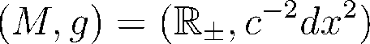

## raytracer:

Trace rays in the conformally Euclidean half space:

  

### Demo:
Here we have a wavespeed:

  

We plot a family of rays leaving the boundary on normal trajectories
(blue lines). Isochrones from the boundary are approximated by linearly
interploating between the rays (green lines).

  

Here, we fire a ray on a normal trajectory from the boundary (blue
line). Then we fire rays from the final point, p, reached at time T
back at the boundary (red lines). We plot linearly interploated
isochrones from the point p (green lines).

  

